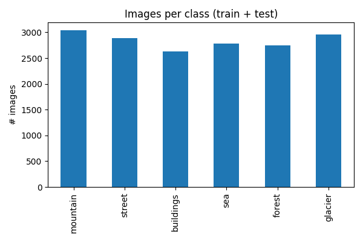
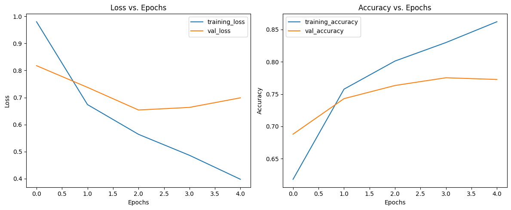
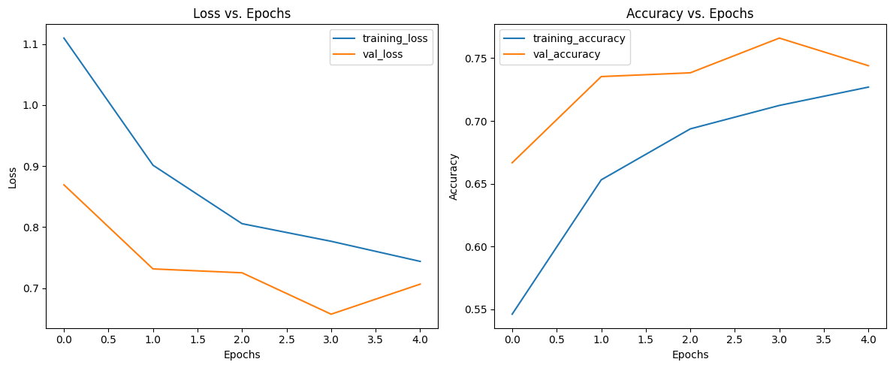

# Intel Natural Scene Classification (TensorFlow / Keras)

> Six-class image-recognition model for **buildings, forest, glacier, mountain, sea, street** scenes, built in Google Colab.

## 📦 Dataset
- **Source:** [Intel Image Classification](https://www.kaggle.com/datasets/puneet6060/intel-image-classification)  
- **Size:** ≈ 25 000 RGB images &nbsp;·&nbsp; 150 × 150 px  
- **Splits (original):** `seg_train` · `seg_test` · `seg_pred`  
- **Classes (6):** `buildings`, `forest`, `glacier`, `mountain`, `sea`, `street`  
- **License:** Free for research & non-commercial use (see Kaggle page)


## 🔍 Exploratory Data Analysis (EDA)

| Class      | Train | Test | **Total** |
|-----------:|------:|-----:|----------:|
| Mountain   | 2 512 |  525 | 3 037 |
| Street     | 2 382 |  501 | 2 883 |
| Buildings  | 2 191 |  437 | 2 628 |
| Sea        | 2 274 |  510 | 2 784 |
| Forest     | 2 271 |  474 | 2 745 |
| Glacier    | 2 404 |  553 | 2 957 |
| **Total**  | **14 034** | **3 000** | **17 034** |

Key findings 🔎  

1. **Balanced:** each class varies by < 10 % from the mean (≈ 2.8 k), so plain accuracy remains a reliable headline metric.  
2. **Fixed resolution:** every file is 150 × 150 px → no resizing overhead during training.  
3. **Scene diversity:** sample grids (see notebook) confirm varied lighting and viewpoints, so augmentations (flip / rotate / colour jitter) are essential.


<p align="center">
  
</p>

## 🛠️ Baseline data pipeline (no augmentation)

Starting with a *minimal* pipeline to establish a reference score:

```python
from tensorflow.keras.preprocessing.image import ImageDataGenerator

train_datagen = ImageDataGenerator(rescale=1/255.)
test_datagen  = ImageDataGenerator(rescale=1/255.)

train_data = train_datagen.flow_from_directory(
    TRAIN_DIR, target_size=(150, 150), batch_size=32, class_mode="categorical"
)
test_data  = test_datagen.flow_from_directory(
    TEST_DIR,  target_size=(150, 150), batch_size=32, class_mode="categorical"
)
```

## 🧪 Baseline model — Tiny CNN from scratch (no augmentation)

### Architecture
```python
model = Sequential([
    Conv2D(10, 3, activation="relu", input_shape=(150, 150, 3)),
    Conv2D(10, 3, activation="relu"),
    MaxPool2D(pool_size=2, padding="valid"),
    Conv2D(10, 3, activation="relu"),
    Conv2D(10, 3, activation="relu"),
    MaxPool2D(pool_size=2, padding="valid"),
    Flatten(),
    Dense(6, activation="softmax")
])
model.compile(
    loss="categorical_crossentropy",
    optimizer=Adam(),
    metrics=["accuracy"]
)
```

<p align="center">  </p>

Take-aways 🔎  

1. The tiny CNN already breaks the 70 % barrier, proving the classes are visually separable  
2. Validation/Test trails Train by ≈ 9 % → classic under-fit scenario; deeper nets or augmentation should close the gap.  
3. Baseline serves as a yard-stick—any later model must beat 78 % test accuracy to justify added complexity.

## 🧪 Experiment 2 — Same tiny CNN **with real-time data augmentation**

### Augmentation policy
```python
train_aug = ImageDataGenerator(
    rescale=1/255.,
    rotation_range=0.2,
    width_shift_range=0.2,
    height_shift_range=0.2,
    zoom_range=0.2,
    horizontal_flip=True
)
train_data_aug = train_aug.flow_from_directory(
    TRAIN_DIR, target_size=(150, 150), batch_size=32, class_mode="categorical"
)
```

<p align="center">  </p>
