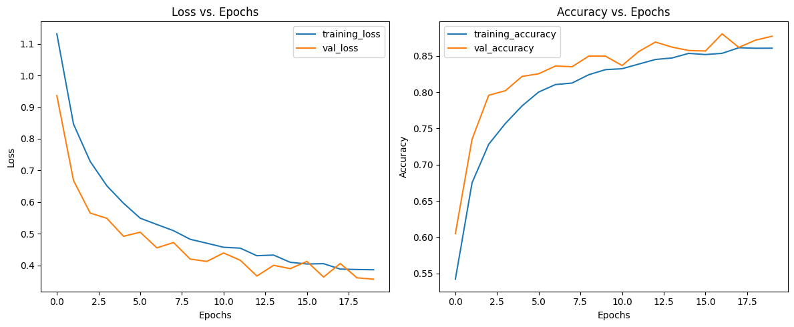

# Intel Natural Scene Classification (TensorFlow / Keras)

> Six-class image-recognition model for **buildings, forest, glacier, mountain, sea, street** scenes, built in Google Colab.

## 📦 Dataset
- **Source:** [Intel Image Classification](https://www.kaggle.com/datasets/puneet6060/intel-image-classification)  
- **Size:** ≈ 25 000 RGB images  Â·  150 × 150 px  
- **Splits (original):** `seg_train` · `seg_test` · `seg_pred`  
- **Classes (6):** `buildings`, `forest`, `glacier`, `mountain`, `sea`, `street`  
- **License:** Free for research & non-commercial use (see Kaggle page)


## 🔍 Exploratory Data Analysis (EDA)

| Class      | Train | Test | **Total** |
|-----------:|------:|-----:|----------:|
| Mountain   | 2 512 |  525 | 3 037 |
| Street     | 2 382 |  501 | 2 883 |
| Buildings  | 2 191 |  437 | 2 628 |
| Sea        | 2 274 |  510 | 2 784 |
| Forest     | 2 271 |  474 | 2 745 |
| Glacier    | 2 404 |  553 | 2 957 |
| **Total**  | **14 034** | **3 000** | **17 034** |

Key findings 🔎 

1. **Balanced:** each class varies by < 10 % from the mean (≈ 2.8 k), so plain accuracy remains a reliable headline metric.  
2. **Fixed resolution:** every file is 150 × 150 px → no resizing overhead during training.  
3. **Scene diversity:** sample grids (see notebook) confirm varied lighting and viewpoints, so augmentations (flip / rotate / colour jitter) are essential.


<p align="center">
  
</p>

## 🛠️ Baseline data pipeline (no augmentation)

Starting with a *minimal* pipeline to establish a reference score:

```python
from tensorflow.keras.preprocessing.image import ImageDataGenerator

train_datagen = ImageDataGenerator(rescale=1/255.)
test_datagen  = ImageDataGenerator(rescale=1/255.)

train_data = train_datagen.flow_from_directory(
    TRAIN_DIR, target_size=(150, 150), batch_size=32, class_mode="categorical"
)
test_data  = test_datagen.flow_from_directory(
    TEST_DIR,  target_size=(150, 150), batch_size=32, class_mode="categorical"
)
```

## 🧪 Baseline model — Tiny CNN from scratch (no augmentation)

### Architecture
```python
model = Sequential([
    Conv2D(10, 3, activation="relu", input_shape=(150, 150, 3)),
    Conv2D(10, 3, activation="relu"),
    MaxPool2D(pool_size=2, padding="valid"),
    Conv2D(10, 3, activation="relu"),
    Conv2D(10, 3, activation="relu"),
    MaxPool2D(pool_size=2, padding="valid"),
    Flatten(),
    Dense(6, activation="softmax")
])
model.compile(
    loss="categorical_crossentropy",
    optimizer=Adam(),
    metrics=["accuracy"]
)
```

<p align="center">  </p>

Take-aways 🔎 

1. The tiny CNN already breaks the 70 % barrier, proving the classes are visually separable  
2. Validation/Test trails Train by ≈ 9 % → classic under-fit scenario; deeper nets or augmentation should close the gap.  
3. Baseline serves as a yard-stick—any later model must beat 78 % test accuracy to justify added complexity.

## 🧪 Experiment 2 — Same tiny CNN **with real-time data augmentation**

### Augmentation policy
```python
train_aug = ImageDataGenerator(
    rescale=1/255.,
    rotation_range=0.2,
    width_shift_range=0.2,
    height_shift_range=0.2,
    zoom_range=0.2,
    horizontal_flip=True
)
train_data_aug = train_aug.flow_from_directory(
    TRAIN_DIR, target_size=(150, 150), batch_size=32, class_mode="categorical"
)
```

<p align="center">  </p>


What happened 🔎 

1. Accuracy ↓ (–3.8 pp) — heavy augmentations stressed the tiny network; capacity wasn’t enough to generalise.  
2. Regularisation effect: Train ≈ Val curves track closely → under-fit rather than over-fit.

## 🧪 Experiment 3 — Large-ish CNN trained from scratch + light augmentation

### Architecture
```python
model = Sequential([
    # Block 1
    Conv2D(32, 3, activation="relu", input_shape=(150, 150, 3)),
    Conv2D(32, 3, activation="relu"),
    MaxPool2D(pool_size=2, padding="valid"),

    # Block 2
    Conv2D(64, 3, activation="relu"),
    Conv2D(64, 3, activation="relu"),
    MaxPool2D(pool_size=2, padding="valid"),

    # Block 3
    Conv2D(128, 3, activation="relu"),
    Conv2D(128, 3, activation="relu"),
    MaxPool2D(pool_size=2, padding="valid"),

    Flatten(),
    Dense(6, activation="softmax")
])
```

<p align="center">  </p>

Observations 🔎 

1. ▲ +9.5 pp over the baseline (tiny CNN, no aug) 
2. Validation curve exceeds train accuracy late in training → augmentation acts as regularisation
3. No BatchNorm/Dropout yet the model avoids over-fitting thanks to lighter aug policy


## 📊 Model comparison & take-aways

| # | Model | Params | Augmentation | Epochs | **Test Acc.** | Δ vs. prev |
|---|-------|-------:|-------------|-------:|-------------:|-----------:|
| **1** | **Tiny CNN** – *baseline* | 0.03 M | none | 5 | **0.782** | — |
| **2** | Tiny CNN + **strong aug** | 0.03 M | rot 20° · shift/zoom 20 % · H-flip | 5 | **0.744** | –3.8 pp |
| **3** | **Large-ish CNN** + gentle aug | 1.0 M | rot 10° · shift/zoom 10 % · H-flip | 20 | **0.877** | +13.3 pp |


### Key observations

1. **Capacity matters.**  
   Scaling parameters from 30 k → 1 M (while adding an extra conv block) delivered the largest single jump in accuracy (+9.5 pp over Model 1).

2. **Augmentation must match model size.**  
   Heavy 20 % shifts/rotations *hurt* the tiny network (Model 2), pushing accuracy **down** by 3–4 pp.  
   A lighter 10 % policy + bigger net (Model 3) acts as regulariser and boosts generalisation.

3. **Under-fit → just add epochs.**  
   The large-ish CNN needed ~18 epochs before the val-curve plateaued; stopping at 5 epochs (like Models 1-2) would have masked its potential.

4. **No transfer learning required (yet).**  
   Reaching **87.7 %** with random-init weights proves that good architecture/regularisation choices can rival pretrained backbones on mid-sized datasets.


### What’s next?

* **BatchNorm + Dropout** – stabilise deeper stacks and maybe push past 90 %.  
* **GlobalAveragePooling** – shave parameters & improve robustness.  
* **Explainability** – Grad-CAMs to show which scene elements drive predictions.  
* **Deployment** – TFLite conversion (≤ 2 MB) for on-device inference.

> **Rule of thumb:**  
> *Small data ⇒ mild aug or bigger nets.*  
> *Big aug ⇒ give the model room to learn, or it will simply drown in noise.*
